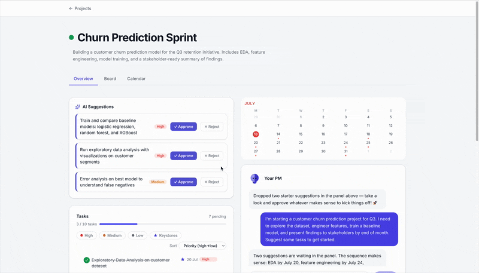
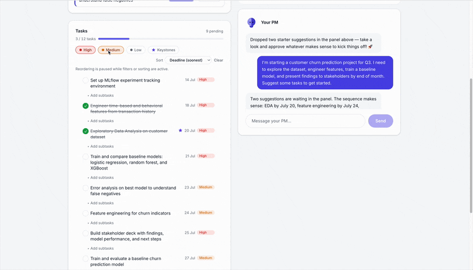

# dblzerolabs

A lightweight AI task manager for Data Scientists — with a PM-agent chat that helps you keep momentum, minus the gamification.

**Live demo:** [https://dblzerolabs.com/)



## Stack

- **Next.js (App Router)** + **TypeScript**
- **Tailwind CSS**
- **Supabase (Postgres)** for persistence
- **Anthropic Claude API** for the PM-agent chat (tool use for task creation/updates)

## Why this project exists

Pathfinder is three things at once:

1. **A real product.** An AI-assisted task manager built for the way Data Scientists actually work — projects, tasks, and a conversational PM agent that can create and prioritize tasks via tool use, without turning project management into a game.
2. **A living research platform.** The app is instrumented to run a pre-registered causal inference experiment on its own users: does AI-assigned task priority actually improve completion rates, compared to a simple due-date baseline? See [Research](#research) below.
3. **A portfolio piece.** End-to-end ownership of product design, a production Next.js/Supabase app, an LLM-powered feature, and a rigorously designed causal experiment — from hypothesis to instrumentation to analysis plan.

## What it does

- Sign up / log in and create projects to organize your work
- Create, update, and complete tasks and subtasks within a project, with priority levels (high/medium/low) and due dates
- Board (Kanban: To Do / In Progress / Done) and calendar views per project

  

- Chat with a Claude-powered PM agent that, via tool use, can create tasks, suggest new tasks for you to approve or reject, update task status/priority, and list existing tasks and subtasks

## Research

Pathfinder includes a **pre-registered A/B experiment**: does ordering tasks by AI-assigned priority (high → medium → low) increase 7-day task completion rate, compared to ordering by due date alone?

- **Design:** user-level randomization, one-sided hypothesis test, pre-stated primary and guardrail metrics, pre-stated limitations — all committed before any analysis was run.
- **Estimators:**
  - Two-sample t-test (primary significance test)
  - DoWhy backdoor adjustment (primary causal estimator)
  - Double ML (via EconML, robustness check)
  - Propensity Score Matching (robustness check)
  - Difference-in-Differences (where panel data is available)
- **Status:** experiment is pre-registered and instrumented; analysis is in progress. Results aren't final yet — this README will be updated with findings once the study is closed out.

## Getting started

```bash
npm install
cp .env.local.example .env.local   # fill in your own Supabase + Anthropic keys
```

Run the SQL migrations in `supabase/migrations/` (in order) against your Supabase project's SQL Editor before starting the app.

```bash
npm run dev
```
